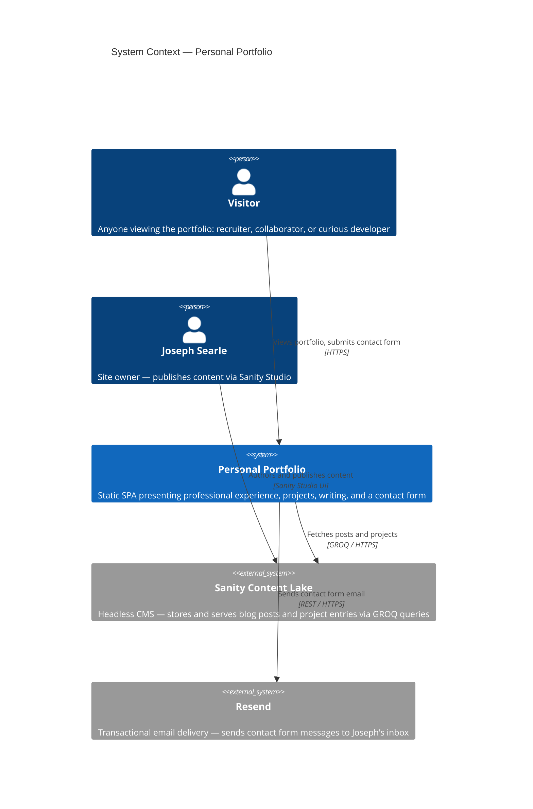

# 01 — System Context

**Audience:** Business stakeholders, architects  
**Question answered:** What does this system do, who uses it, and what does it depend on?

---

## System purpose

Joseph Searle's personal portfolio is a publicly accessible website that presents his professional experience, open-source projects, and writing to recruiters, collaborators, and the broader engineering community. It provides a contact form through which visitors can send messages directly to Joseph's inbox.

The system is a portfolio and contact channel — not a product, not a SaaS application. It has no user accounts, no persistent client-side state, and no administrative interface beyond the Sanity Studio, which is deployed separately.

---

## Context diagram

---

## External actors

| Actor               | Type            | Interaction                                                                       |
| ------------------- | --------------- | --------------------------------------------------------------------------------- |
| Visitor             | Person          | Browses the portfolio, reads blog posts, submits the contact form                 |
| Joseph Searle       | Person          | Authors content in Sanity Studio; receives contact form emails                    |
| Sanity Content Lake | External system | Source of truth for blog posts and project entries; queried at runtime via GROQ   |
| Resend              | External system | Delivers contact form emails to Joseph's inbox; requires a verified sender domain |

---

## What is outside this system

The following are explicitly outside the portfolio system boundary:

- **Sanity Studio** — the CMS authoring interface is deployed separately to `<project>.sanity.studio` and is not part of this codebase's deployable output
- **Joseph's email inbox** — Resend delivers messages there; the inbox itself is unrelated infrastructure
- **Vercel** — the deployment and CDN platform; infrastructure, not part of the application
- **The visitor's browser** — assumed to be a modern browser with JavaScript enabled; the app does not polyfill for legacy browsers
