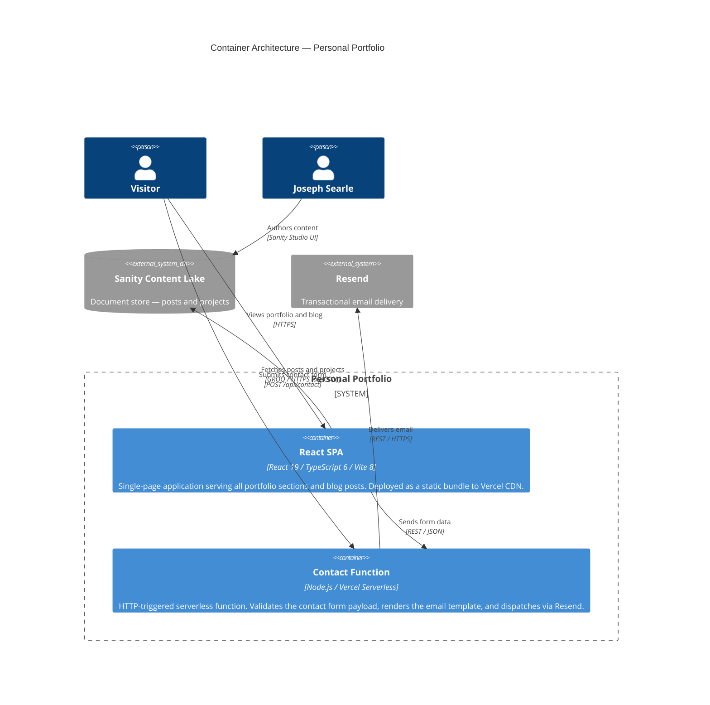

# 02 — Container Architecture

**Audience:** Architects, senior engineers  
**Question answered:** What are the deployable units and how do they communicate?

---

## Container diagram

---

## Container responsibilities

| Container        | Technology                     | Responsibility                                                                   | Entry point      |
| ---------------- | ------------------------------ | -------------------------------------------------------------------------------- | ---------------- |
| React SPA        | React 19, TypeScript 6, Vite 8 | Renders all portfolio sections, handles client-side routing, fetches CMS content | `src/main.tsx`   |
| Contact Function | Node.js 20, `@vercel/node`     | Validates form payload (Zod), renders React Email template, calls Resend API     | `api/contact.ts` |

---

## Serverless function trigger catalog

| Function  | Trigger | Path           | Method | Timeout               | Notes                                                         |
| --------- | ------- | -------------- | ------ | --------------------- | ------------------------------------------------------------- |
| `contact` | HTTP    | `/api/contact` | POST   | 10 s (Vercel default) | Cold start adds ~200 ms on first invocation after idle period |

---

## Communication patterns

All communication between containers and external systems is synchronous over HTTPS.

**SPA → Sanity Content Lake:** The three Sanity hooks (`useSanityPosts`, `useSanityProjects`, `useSanityPost`) issue typed GROQ queries via `@sanity/client` with `useCdn: true`. The Sanity CDN caches responses; the SPA receives JSON shaped by the GROQ projection to match the app's TypeScript types directly — no client-side transformation layer is needed.

**SPA → Contact Function:** The contact form issues a `fetch` POST to `/api/contact` with a JSON body. Vercel's routing (`vercel.json` rewrite rule) directs all `/api/*` requests to the serverless runtime rather than serving them as static files.

**Contact Function → Resend:** The function calls `resend.emails.send()` with an HTML string produced by `@react-email/render`. There is no queue, retry mechanism, or dead-letter queue — a Resend API failure returns an HTTP 500 to the browser.

---

## Static-first CMS overlay

The SPA ships with static fallback data in `src/data/` (TypeScript arrays matching the schema exactly). At runtime, if `VITE_SANITY_PROJECT_ID` is set, the Sanity hooks fetch live content and replace the static data after mount. If the env var is absent or the fetch fails, the static data remains. The site is therefore fully functional with no CMS dependency.

This pattern means:

- Local development requires no Sanity credentials
- The site never renders blank from a CMS outage
- Connecting or disconnecting the CMS requires only toggling one environment variable
