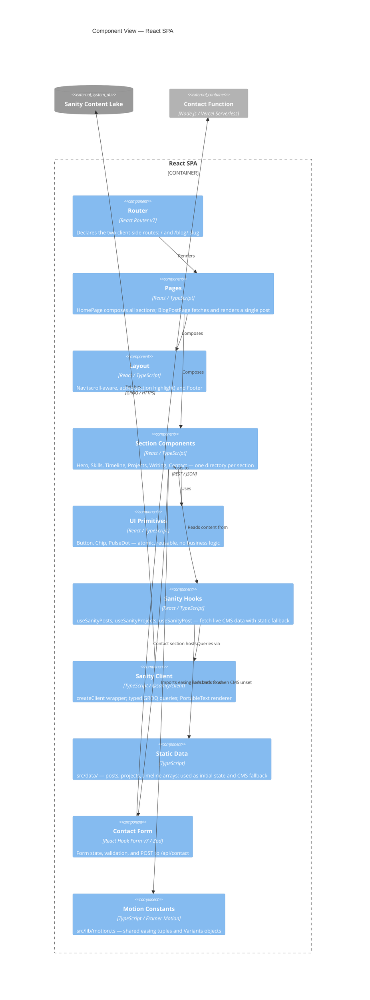

# 03 — Component View

**Audience:** Engineers  
**Question answered:** What are the major structural units inside the React SPA?

---

## Component diagram



---

## Dependency direction rules

Dependencies flow in one direction only: outward from pages toward primitives. No component imports from a parent or sibling section.

```
Pages
  └── Layout components (Nav, Footer)
  └── Section components
        └── UI primitives (Button, Chip, PulseDot)
        └── Sanity hooks
              └── Sanity client lib
              └── Static data (fallback)
        └── Contact form
        └── Motion constants
```

**Rules enforced by convention (no lint rule currently):**

- Section components do not import from other section components
- UI primitives have no business logic and no data-fetching
- Sanity hooks are the only components that call `@sanity/client` — sections never import the client directly

---

## Key structural decisions

**Co-located tests.** Every component file is paired with a `.test.tsx` file in the same directory. There is no central `__tests__/` directory. This makes coverage gaps immediately visible in the file tree.

**Single router file.** `App.tsx` defines both routes (`/` and `/blog/:slug`) using `createBrowserRouter`. Adding a new route means editing one file. Route-level code splitting is not implemented (the bundle is sufficiently small for a personal portfolio).

**PortableText renderer.** `src/lib/sanity/portableText.tsx` maps Sanity Portable Text blocks to React elements with design-token class names. It is the only component that couples Sanity's rich-text format to the app's visual language.

**TypeScript project references.** Three `tsconfig.*.json` files cover three environments (`src/`, `vite.config.ts`, `api/` + `emails/`). This is a structural decision affecting the build — see [ADR-0007](adr/0007-vitest-rtl-msw-testing-strategy.md) for testing implications and `docs/architecture.md` for the full tsconfig table.
