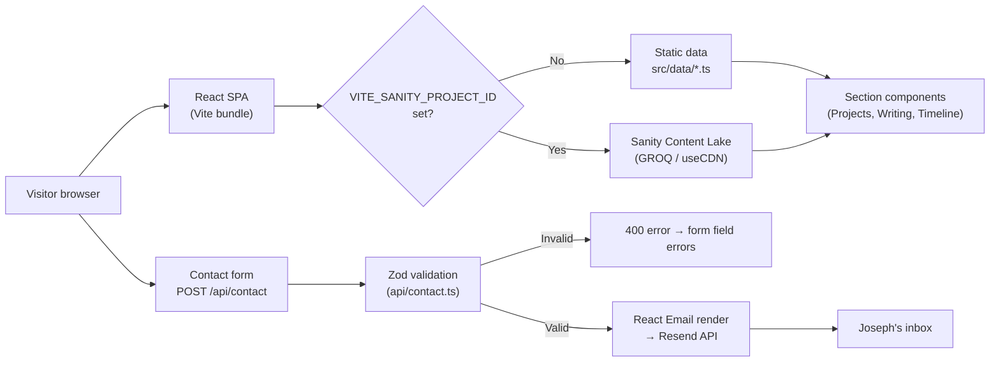

# 04 — Data Architecture

**Audience:** Engineers  
**Question answered:** Where does data live, who owns it, and how does it flow?

---

## Data store inventory

| Store                      | Type                        | Technology               | Data owned                        | Shared?                                                 |
| -------------------------- | --------------------------- | ------------------------ | --------------------------------- | ------------------------------------------------------- |
| Sanity Content Lake        | Document store (external)   | Sanity / GROQ            | Blog posts, project entries       | No — owned by Sanity project                            |
| Static data arrays         | In-process (build artefact) | TypeScript (`src/data/`) | Posts, projects, timeline entries | Read-only at runtime; no writes                         |
| No client-side persistence | —                           | —                        | —                                 | The app uses no `localStorage`, `IndexedDB`, or cookies |

There is no relational database. The serverless contact function is stateless — it validates and forwards a request, then discards all data.

---

## Data flow diagram

---

## Data schemas

### Sanity document types

Two document schemas live in `studio/schemaTypes/`:

**`post`** — blog post

- `title` (string)
- `slug` (slug, unique)
- `publishedAt` (datetime)
- `excerpt` (text)
- `body` (portable text array)

**`project`** — portfolio project entry

- `title` (string)
- `description` (text)
- `tags` (array of strings)
- `url` (url, optional)
- `repoUrl` (url, optional)
- `featured` (boolean)

GROQ projections in `src/lib/sanity/queries.ts` reshape these to match the app's TypeScript types directly — `_id → id`, `publishedAt → date`, `slug.current → slug`. The client receives exactly the shape the component needs; there is no transformation layer between the query result and the component props.

### Contact form payload

Defined once in `src/schemas/contact.ts` (Zod schema). The same schema is imported by both the client-side form (`ContactForm.tsx`) and the serverless function (`api/contact.ts`). Fields:

| Field     | Type   | Validation         |
| --------- | ------ | ------------------ |
| `name`    | string | 1–100 characters   |
| `email`   | string | valid email format |
| `message` | string | 10–2000 characters |

---

## State management strategy

The SPA uses no global state library (no Redux, Zustand, or Context for data). Each section component manages its own data through a dedicated hook:

- `useSanityPosts` — fetches the post list; initialises with `src/data/posts.ts`
- `useSanityProjects` — fetches the project list; initialises with `src/data/projects.ts`
- `useSanityPost(slug)` — fetches a single post by slug for `BlogPostPage`

All three hooks share the same pattern: initialise with static data, attempt a Sanity fetch if configured, silently keep static data on failure. There is no caching layer beyond the Sanity CDN itself (`useCdn: true` sends requests to Sanity's global CDN rather than the origin API).

---

## Data ownership notes

The Sanity Content Lake is an external managed service. The content data (posts, projects) is owned by the Sanity project, not by this codebase. A migration or export would require using the Sanity CLI (`sanity dataset export`).

The static fallback data in `src/data/` is maintained manually and should be kept in sync with the Sanity schema. Divergence between the static data shapes and the Sanity schema will surface as TypeScript type errors at build time, since the same TypeScript types (`Post`, `Project`, `TimelineEntry` in `src/types/index.ts`) are used for both.
