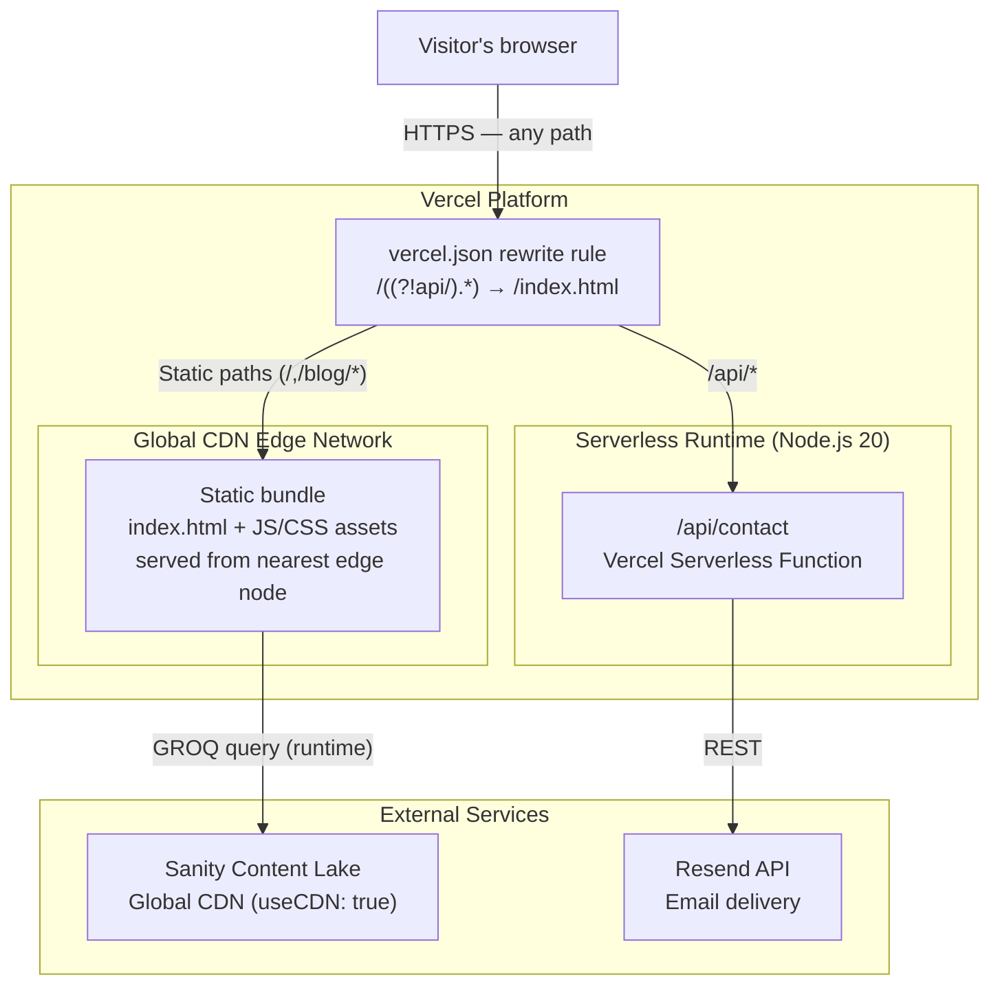

# 05 — Deployment

**Audience:** Engineers, DevOps  
**Question answered:** How is the system deployed, where does it run, and what does the CI/CD pipeline look like?

---

## Deployment architecture



---

## Environments

| Environment       | Purpose       | URL / Endpoint                                             | Deployment trigger          |
| ----------------- | ------------- | ---------------------------------------------------------- | --------------------------- |
| Production        | Live site     | `https://josephsearle.dev` <!-- TODO: confirm live URL --> | Push to `main` branch       |
| Preview           | Per-PR review | Auto-generated `*.vercel.app` URL                          | Push to any non-main branch |
| Local development | Engineering   | `http://localhost:5173`                                    | `npm run dev`               |

---

## Vercel routing configuration

`vercel.json` contains a single rewrite rule:

```json
{
  "rewrites": [{ "source": "/((?!api/).*)", "destination": "/index.html" }]
}
```

The negative lookahead `(?!api/)` means:

- Any request to `/api/*` is handled by the Vercel serverless runtime
- All other requests (including `/blog/some-slug`) are served `index.html` and handled by React Router on the client

---

## Build process

```bash
# TypeScript check across all three tsconfig targets, then Vite bundle
npm run build
# expands to: tsc -b && vite build
```

The `tsc -b` step checks `tsconfig.json` (which references `tsconfig.app.json`, `tsconfig.node.json`, and `tsconfig.api.json`). A type error in `api/contact.ts`, `emails/ContactEmail.tsx`, or `vite.config.ts` will fail the build before Vite runs.

Vite outputs to `dist/`. Vercel reads this directory automatically with zero configuration (it detects the Vite build framework).

---

## CI/CD pipeline

There is currently no GitHub Actions workflow. Vercel's Git integration provides the CI/CD pipeline:

| Step       | How                                                                                 |
| ---------- | ----------------------------------------------------------------------------------- |
| Lint       | <!-- TODO: add a lint step to Vercel build command or a GitHub Actions workflow --> |
| Type check | `tsc -b` runs as part of `npm run build` in the Vercel build step                   |
| Tests      | <!-- TODO: run `npm run test:run` in CI before deploy -->                           |
| Build      | Vercel runs `npm run build` on every push                                           |
| Deploy     | On success: production deploy (main) or preview deploy (other branches)             |

**Recommended next step:** Add a GitHub Actions workflow that runs `npm run lint` and `npm run test:run` on every pull request, gating the merge. See [09-risks-and-debt.md](09-risks-and-debt.md) for the risk entry.

---

## Environment variables

Environment variables for production are set in the Vercel project dashboard. They are not read from `.env.local` in the Vercel build environment.

| Variable                  | Required in production                    | Set in Vercel dashboard |
| ------------------------- | ----------------------------------------- | ----------------------- |
| `RESEND_API_KEY`          | Yes                                       | Yes                     |
| `RESEND_FROM_EMAIL`       | Yes                                       | Yes                     |
| `VITE_SANITY_PROJECT_ID`  | No (site runs with static data if absent) | Recommended             |
| `VITE_SANITY_DATASET`     | No (defaults to `production`)             | Optional                |
| `VITE_SANITY_API_VERSION` | No (defaults to `2025-05-07`)             | Optional                |

---

## Cold start characteristics

The Contact Function (`/api/contact`) is a Vercel serverless function with no provisioned concurrency. Cold starts occur after a period of inactivity (typically > 5 minutes on the Vercel free tier).

- **Typical cold start latency:** ~200 ms (Node.js 20 runtime, small function footprint)
- **Acceptable for this use case:** Yes — the contact form is not a latency-sensitive path
- **Mitigation:** None currently applied. Provisioned concurrency is not warranted for a personal portfolio's contact form.

---

## Sanity Studio deployment

The Sanity Studio (`studio/` directory) is a separate deployment to `<project>.sanity.studio`. It is not part of the Vite build or Vercel deployment. Deploy and update it independently using the Sanity CLI:

```bash
cd studio
sanity deploy
```
